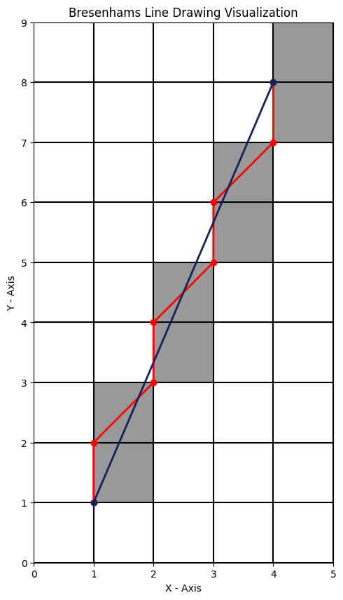

<div align = "center">

### 🧠 Computer Graphics and Image Processing

------ **📚 Assignment 1 : Bresenham's Line Drawing Algorithm 📚** ------

#### ✍️ Assignment Solution : **([👉 Click Here](./Bresenham's%20Line.ipynb) )**

<hr>
</div>

## 📌 Bresenham's Line Drawing Algorithm


```python
def bresenhams_line(x_start, y_start, x_end, y_end):
   # Initialize lists for points
    points = []
    
    # Assign initial values
    x, y = x_start, y_start
    
    # Finding Delta X , Y values
    delta_y = y_end - y_start  # Δy = y6 - y1
    delta_x = x_end - x_start  # Δx = x6 - x1
    
    # Creating Base Decision Parameter
    decisionParameter = 2 * delta_y - delta_x  # d1 = 2Δy - Δx

    # Generate points for the line
    while x <= x_end:
        points.append((x, y))
        x += 1
        if decisionParameter < 0: #  if(di < 0) 
            decisionParameter = decisionParameter + 2 * delta_y # d(i+1) = di + 2Δy
        else:
            decisionParameter = decisionParameter + 2 * delta_y - 2 * delta_x #d(i+1) = di + 2Δy - 2Δx
            y += 1
    
    # Define start and end points
    start_point = (x_start, y_start)
    end_point = (x_end, y_end)
   
    
    # Call the plot function
    draw_plot(points, start_point, end_point)
```
### 📌 **Bresenham's Line Drawing : Input : Start Point (1,1) && End Point (8,4)**

##### 👉 Slope :  0.42857142857142855 :  (`0 < m < 1`)


## 👉 Above Algorithm Approach Satisfy Only Lines (`0 < m < 1`)

If the slope of the line is greater than 1, then the algorithm will not work properly. So, we need to modify the algorithm to handle all cases. For example

### 📌 **Bresenham's Line Drawing : Input : Start Point (1,1) && End Point (4,8)**

##### 👉 Slope :  2.3333333333333335 :  (`m > 1`)


### 👉 Here Line Drawing : Input : Start Point (1,1) && End Point (4,8) is generating `a wrong line`

Slope = 2.33333 : where `m > 1`

**Previous Bresenham's Line Algorithm Function was for `0 < m < 1`** ; 

That's why we need to convert the line drawing algorithm for `m > 1`

<hr>

### 📌 **(NEW) Bresenham's Line Drawing Algorithm for** `m > 1`
Updating Code For `slope > 1`:
- Calculate the differences in x and y coordinates `(delta_x and delta_y)`.

- Set a flag `swapped` to False. This flag will be used to track if the roles of x and y were swapped.

- Check if the absolute value of the slope (delta_y / delta_x) is greater than 1. 

- If it is `abs(delta_y) > abs(delta_x)`, swap the roles of x and y, swap the start and end coordinates, `swap delta_x and delta_y`, and set swapped to True.

- Calculate the initial decision parameter based on delta_x and delta_y like previous function

- After calculating the decision parameters : if`swapped is True`, `swap the x and y` values in the points list and the start and end coordinates.

- Call the draw_plot function with the points, start point, and end point.


```python
def bresenhams_line_new(x_start, y_start, x_end, y_end):
    # Initialize lists for points
    points = []
    
    # Assign initial values
    x, y = x_start, y_start
    
    # Finding Delta X , Y values
    delta_y = y_end - y_start  # Δy = y2 - y1
    delta_x = x_end - x_start  # Δx = x2 - x1
    
    # Flag to check if roles of x and y were swapped
    swapped = False

    # Check if the absolute value of the slope is greater than 1
    if abs(delta_y) > abs(delta_x):
        # Swap the roles of x and y
        x, y = y, x
        x_start, y_start = y_start, x_start
        x_end, y_end = y_end, x_end
        delta_x, delta_y = delta_y, delta_x
        swapped = True

    # Creating Base Decision Parameter
    decisionParameter = 2 * delta_y - delta_x  # d1 = 2Δy - Δx

    # Generate points for the line
    while x <= x_end:
        points.append((x, y))
        x += 1
        if decisionParameter < 0: #  if(di < 0) 
            decisionParameter = decisionParameter + 2 * delta_y # d(i+1) = di + 2Δy
        else:
            decisionParameter = decisionParameter + 2 * delta_y - 2 * delta_x #d(i+1) = di + 2Δy - 2Δx
            y += 1

    # Swap x and y back to their original roles if they were swapped
    if swapped:
        points = [(y, x) for x, y in points]
        x_start, y_start = y_start, x_start
        x_end, y_end = y_end, x_end

    # Define start and end points
    start_point = (x_start, y_start)
    end_point = (x_end, y_end)
    
    # Call the plot function
    draw_plot(points, start_point, end_point)
```

## 📌 **Let's Test Our New Bresenham's Line Function for Different Slopes**

#### 👉 **Bresenham's Line Drawing `0 < m <  1` : Input : Start Point (1,1) && End Point (8,4)**


### 👉 **Bresenham's Line Drawing `m > 1` : Input : Start Point (1,1) && End Point (4,8)**

